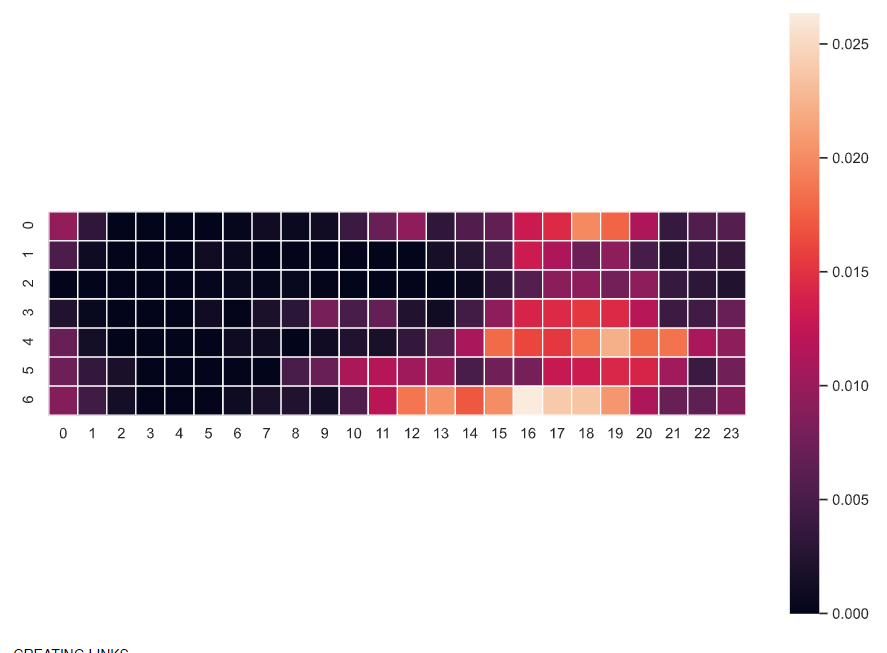

# Discord - Data - Mining

This repo contains two discord bots:
 - One for logging text messages and voice chat activity
 - One for logging online status and game status

I had to split the code into two bots because discord permissions and intents did not permit me to have a bot access status and messages at the same time.

### Usage
Create a firebase database and two discord bot accounts. Add the discord api tokens for both of them to the .env file spin up both of the bots using docker. If you are not running on the google cloud some modifications will be necessary to connect to the firebase database.

### Analysis
I ran this bot for about a month on a discord server I use with my friends and collected data with their permission.

The jupyter notebook `data-analysis/analysis.ipynb` contains my crude analysis of the data and the resulting graph which aims to show relations between the members of my server.

This network graph clearly shows that some members are more strongly connected than others. The algorithm to compute these edges checks if users are online at the same time, send messages at the same times, play the same games and are in voice chat together.

### Online-status

### Voice-activity

### Messages

### Game
